# ARCHITECTURE.md - System Architecture Specification

## 📋 Document Information

**Project**: Liga Manager - Soccer League Management SaaS  
**Version**: 1.0 (MVP)  
**Target Market**: Mexico (Soccer Field Owners)  
**Date**: October 2025  
**Status**: Living Document

---

## 🎯 Executive Summary

### Purpose
Liga Manager is a multi-tenant SaaS platform enabling soccer field owners in Mexico to manage leagues, teams, players, schedules, and match results. The platform prioritizes **data isolation**, **scalability**, and **rapid time-to-market**.

### Key Architecture Decisions
1. **Multi-Tenancy**: Schema-per-tenant (PostgreSQL)
2. **Application Architecture**: Modular monolith (not microservices)
3. **Frontend**: Server-side rendering with Next.js 15
4. **Authentication**: Stateless JWT tokens
5. **Deployment**: Cloud-native on AWS

### Quality Attributes Priority
1. **Security** - Tenant data isolation (critical)
2. **Scalability** - Support 1,000+ tenants
3. **Performance** - <200ms API response time
4. **Availability** - 99.5% uptime
5. **Maintainability** - Easy to extend

---

## 🏗️ System Architecture Overview

### High-Level Architecture

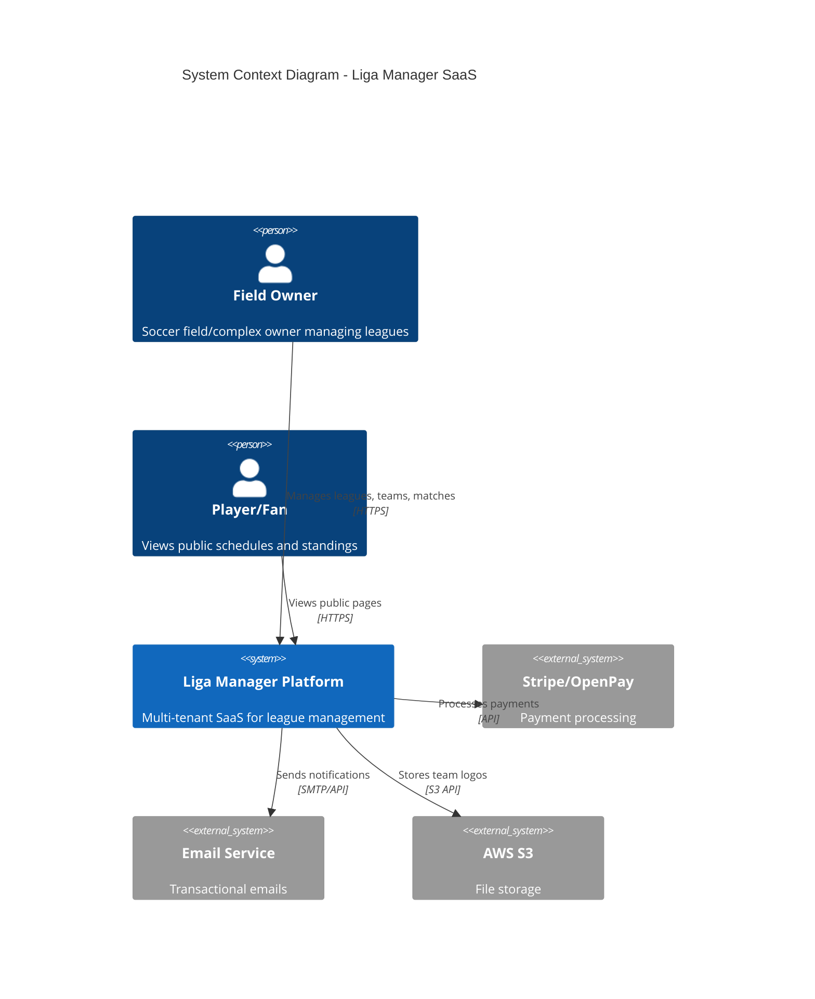

### Container Architecture

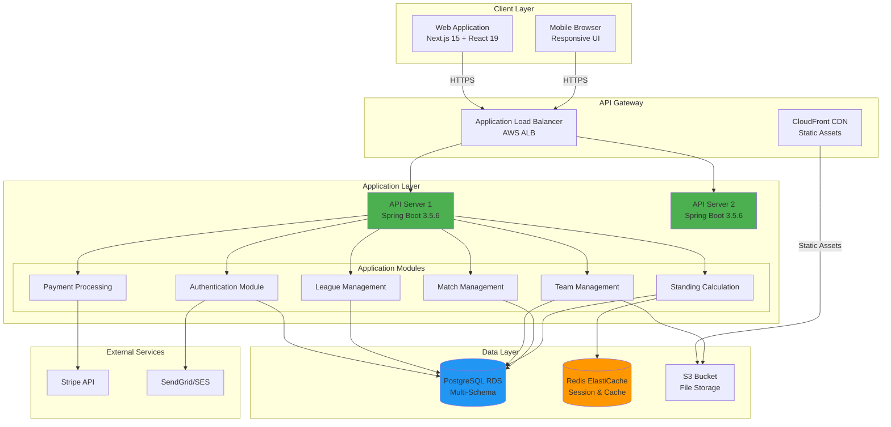

---

## 🔐 Multi-Tenancy Architecture

### Decision: Schema-per-Tenant

**Chosen Strategy**: Schema-per-tenant (PostgreSQL native schemas)

#### Comparison Matrix

| Aspect | Shared Schema | Schema-per-Tenant | Database-per-Tenant |
|--------|---------------|-------------------|---------------------|
| **Isolation** | ❌ Low (app-level) | ✅ High (DB-level) | ✅✅ Highest |
| **Scalability** | ✅✅ Best | ✅ Good | ❌ Poor |
| **Cost** | ✅✅ Lowest | ✅ Low | ❌ High |
| **Complexity** | ✅ Low | ⚠️ Medium | ❌ High |
| **Migration** | ✅ Easy | ⚠️ Medium | ❌ Hard |
| **Query Performance** | ✅ Fast | ✅ Fast | ⚠️ Varies |
| **Backup/Restore** | ⚠️ Complex | ✅ Per-tenant | ✅ Per-tenant |

**Winner for MVP**: ✅ **Schema-per-Tenant**

#### Rationale

**Why Schema-per-Tenant?**
1. **Strong Isolation**: Each tenant's data in separate PostgreSQL schema
2. **Cost-Effective**: Single database handles 1,000+ tenants
3. **Easy Compliance**: Can export/delete tenant data easily (GDPR)
4. **Simple Backups**: `pg_dump --schema=tenant_xyz`
5. **Mexico Market Fit**: Field owners typically manage 2-5 leagues (low volume per tenant)

**Why NOT Shared Schema?**
- ❌ Risk of data leakage (catastrophic for trust)
- ❌ Complex queries (WHERE tenant_id = ? everywhere)
- ❌ Hard to migrate individual tenants

**Why NOT Database-per-Tenant?**
- ❌ Too expensive (1,000 tenants = 1,000 RDS instances)
- ❌ Hard to manage (connection pooling nightmare)
- ❌ Overkill for low-volume tenants

### Schema Architecture

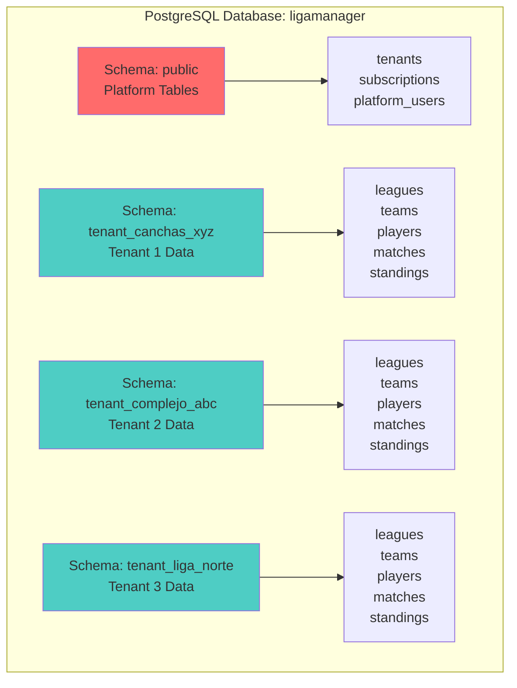

### Tenant Resolution Flow

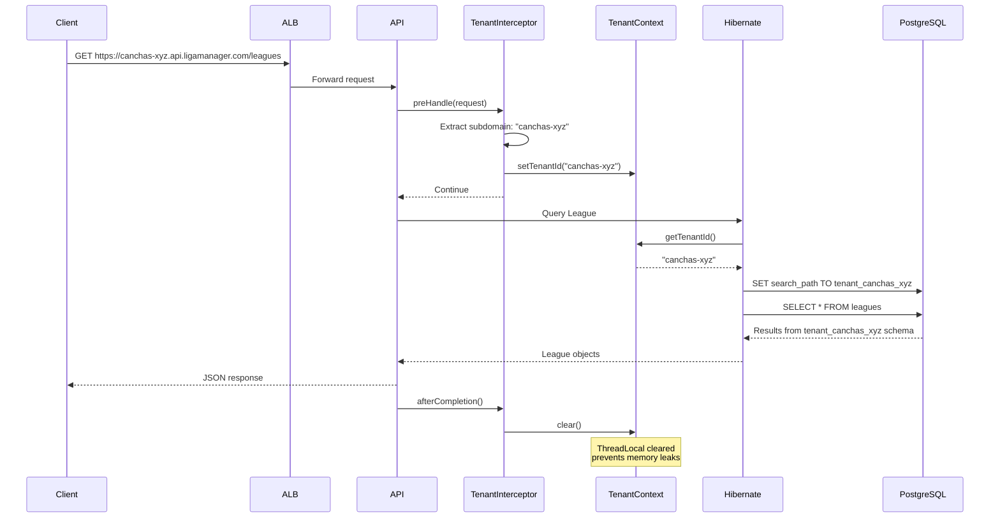

### Tenant Provisioning Flow

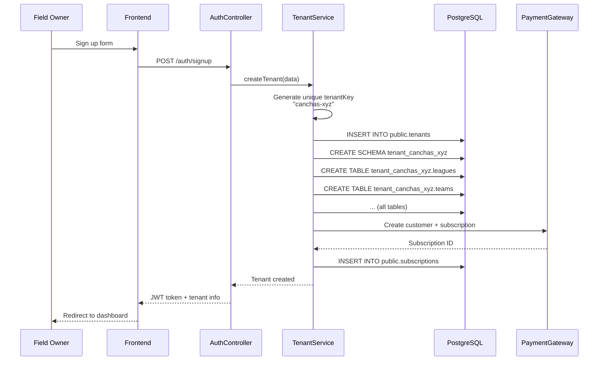

---

## 🔒 Security Architecture

### Authentication Flow (JWT)

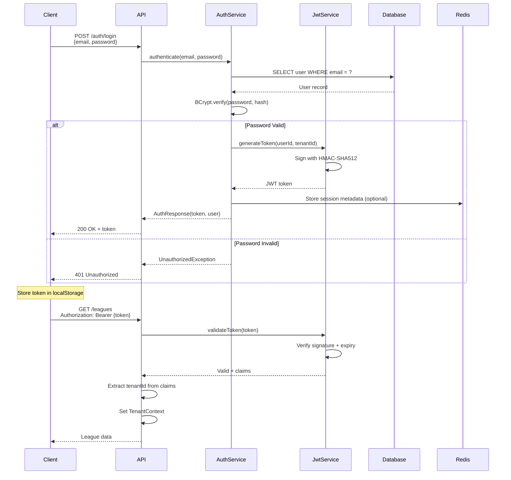

### Security Layers

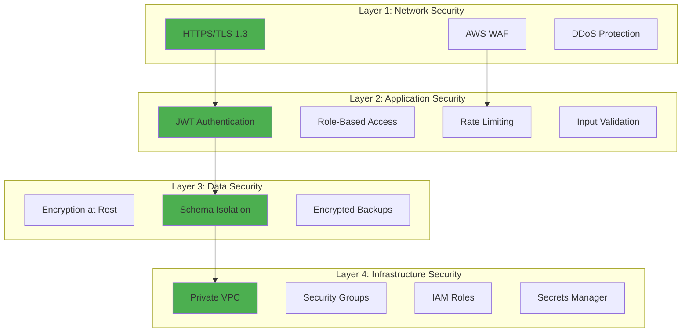

### Authorization Model

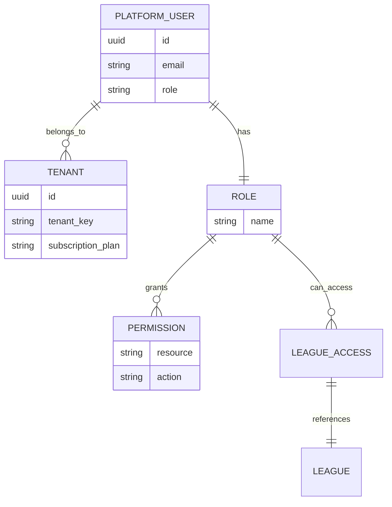

**Roles:**
- `TENANT_ADMIN` - Full access to tenant's data
- `TENANT_VIEWER` - Read-only access
- `PLATFORM_ADMIN` - Anthropic admin (cross-tenant access)

---

## 💾 Data Architecture

### Entity Relationship Diagram (Complete)

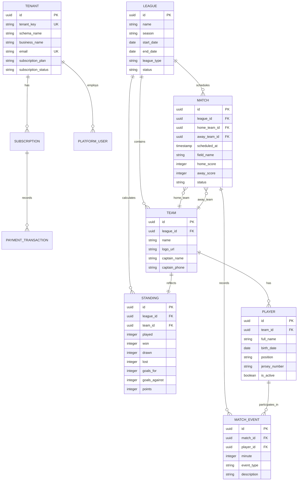

### Data Flow Architecture

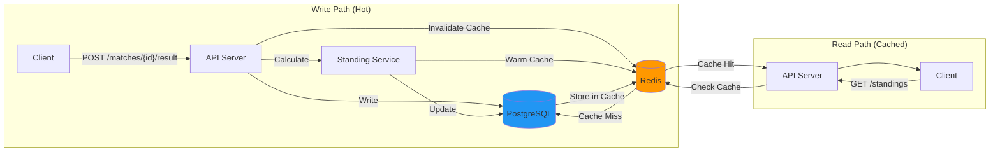

### Caching Strategy

| Data Type | Cache? | TTL | Invalidation |
|-----------|--------|-----|--------------|
| **Standings** | ✅ Yes | 5 min | On match result |
| **Match Schedule** | ✅ Yes | 1 hour | On schedule change |
| **Team Roster** | ✅ Yes | 30 min | On player add/remove |
| **League List** | ✅ Yes | 10 min | On league CRUD |
| **Match Results** | ❌ No | - | Always fresh |
| **User Sessions** | ✅ Yes | 24 hours | On logout |

**Cache Keys Pattern:**
```
standings:{league_id}
matches:{league_id}:upcoming
teams:{league_id}
session:{user_id}
```

---

## 🚀 Deployment Architecture (AWS)

### Production Environment

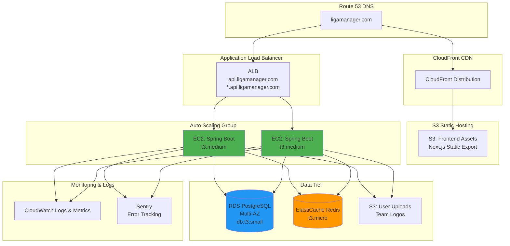

### Infrastructure as Code (Planned)

```yaml
Infrastructure:
  Provider: AWS
  Region: us-east-1 (primary)
  
  Compute:
    - Type: EC2 Auto Scaling
    - Instance: t3.medium (2 vCPU, 4GB RAM)
    - Min: 1, Desired: 2, Max: 5
    - AMI: Amazon Linux 2023
    
  Database:
    - Type: RDS PostgreSQL 15
    - Instance: db.t3.small (2 vCPU, 2GB RAM)
    - Storage: 100GB SSD (auto-scaling to 1TB)
    - Multi-AZ: Yes (HA)
    - Backup: 7-day retention
    
  Cache:
    - Type: ElastiCache Redis 7
    - Instance: cache.t3.micro (0.5GB)
    - Replication: No (for MVP)
    
  Storage:
    - S3 Buckets:
      * Frontend: ligamanager-frontend
      * Uploads: ligamanager-uploads
      * Backups: ligamanager-backups
    
  Networking:
    - VPC: Custom VPC with public/private subnets
    - Load Balancer: Application Load Balancer
    - CDN: CloudFront (frontend assets)
    
  Security:
    - SSL/TLS: ACM Certificates
    - WAF: AWS WAF (rate limiting, SQL injection protection)
    - Secrets: AWS Secrets Manager
```

---

## 🎨 Application Architecture

### Layered Architecture (Backend)

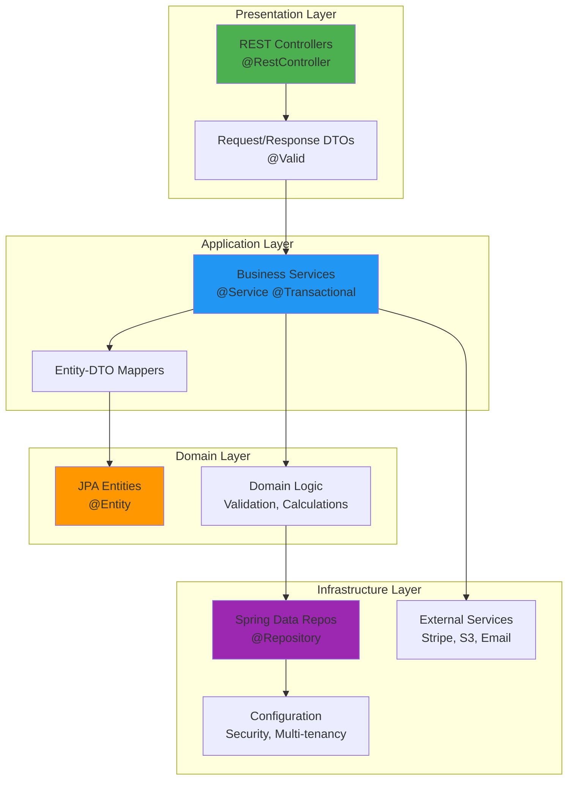

### Module Structure (Frontend - Next.js 15)

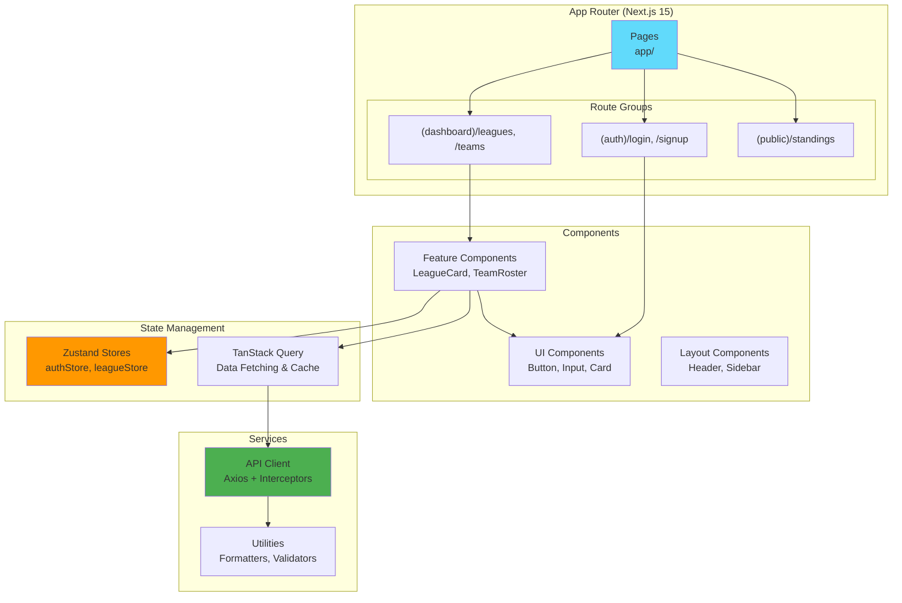

---

## 🔄 API Design Principles

### RESTful API Architecture

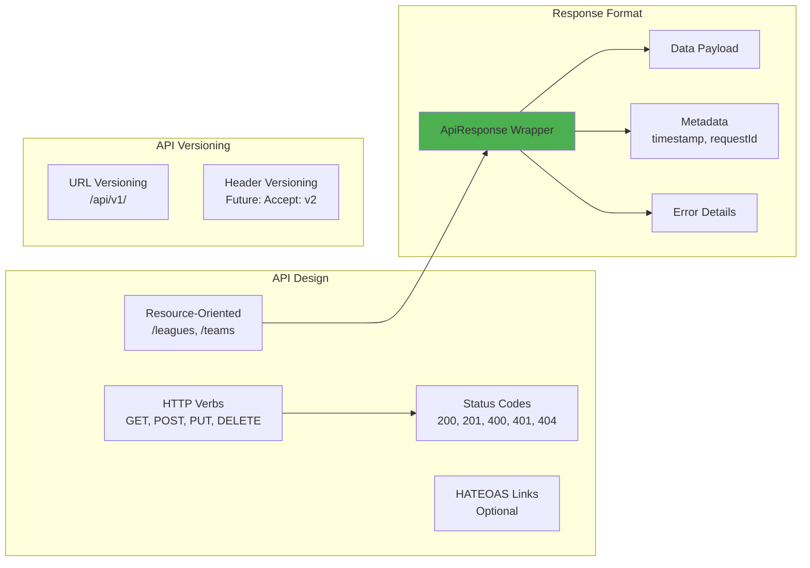

### API Response Structure

```json
{
  "success": true,
  "data": {
    "id": "uuid",
    "name": "Liga Apertura 2025",
    "teams": [...]
  },
  "meta": {
    "timestamp": "2025-01-15T10:30:00Z",
    "requestId": "abc123",
    "pagination": {
      "page": 1,
      "size": 20,
      "total": 45
    }
  }
}
```

---

## 📈 Scalability Strategy

### Scaling Dimensions

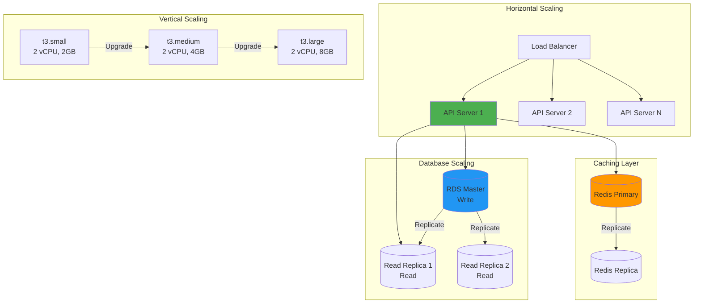

### Growth Milestones

| Tenants | Users | Architecture | Estimated Cost |
|---------|-------|--------------|----------------|
| **0-100** | <1K | 1 EC2 + RDS t3.small | $150/month |
| **100-500** | 1K-5K | 2 EC2 + RDS t3.medium + Read Replica | $450/month |
| **500-2K** | 5K-20K | 3-5 EC2 + RDS t3.large + 2 Replicas | $1,200/month |
| **2K-10K** | 20K-100K | Microservices consideration | $5,000+/month |

---

## 🔮 Evolution Strategy

### Phase 1: MVP (Months 0-3) - CURRENT

```
Architecture: Modular Monolith
Focus: Time to market, validation
Features: Core league management
Deployment: Single region (us-east-1)
```

### Phase 2: Growth (Months 4-12)

```
Architecture: Monolith + Background Jobs
Additions:
  - Celery/SQS for async tasks
  - Read replicas for reporting
  - CDN for all static assets
  - Mobile app (React Native)
Features:
  - Advanced statistics
  - Tournament brackets
  - Payment splitting (teams pay)
  - Email notifications
```

### Phase 3: Scale (Year 2)

```
Architecture: Selective Microservices
Decompose:
  - Payment Service (isolated, PCI compliance)
  - Notification Service (email, SMS, push)
  - Reporting Service (analytics, exports)
Additions:
  - Multi-region deployment (us-east-1, sa-east-1)
  - GraphQL for mobile clients
  - Real-time match updates (WebSocket)
```

### Phase 4: Enterprise (Year 3+)

```
Architecture: Event-Driven Microservices
Patterns:
  - CQRS (Command Query Responsibility Segregation)
  - Event sourcing for match events
  - Saga pattern for distributed transactions
Features:
  - White-label solution
  - API marketplace for third-party integrations
  - AI-powered schedule optimization
  - Live streaming integration
```

### Migration Path: Monolith → Microservices

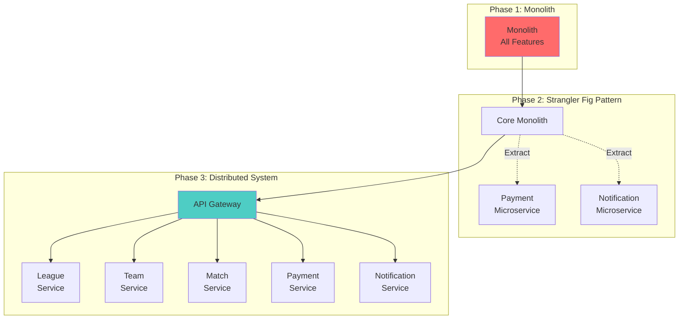

---

## 🏆 Quality Attributes

### Performance Targets

| Metric | Target | Measured By |
|--------|--------|-------------|
| **API Response Time** | <200ms (P95) | CloudWatch |
| **Page Load Time** | <2 seconds | Lighthouse |
| **Database Query** | <50ms (P95) | pg_stat_statements |
| **Cache Hit Ratio** | >80% | Redis INFO stats |
| **Error Rate** | <0.1% | Sentry |

### Availability Targets

```
SLA: 99.5% uptime (monthly)
Allowed downtime: 3.6 hours/month

Components:
- ALB: 99.99% (AWS SLA)
- EC2 (Multi-AZ): 99.95%
- RDS (Multi-AZ): 99.95%
- Redis (no replica): 99.9%
- S3: 99.99%

Calculated availability: 99.5%
```

### Security Checklist

- [x] HTTPS everywhere (TLS 1.3)
- [x] JWT with HMAC-SHA512
- [x] Password hashing (BCrypt, cost=12)
- [x] SQL injection prevention (parameterized queries)
- [x] XSS prevention (React auto-escaping)
- [x] CSRF protection (JWT stateless, no cookies)
- [x] Rate limiting (100 req/min per tenant)
- [x] Input validation (Jakarta Bean Validation)
- [x] Tenant isolation (schema-level)
- [x] Secrets management (AWS Secrets Manager)
- [ ] Penetration testing (before public launch)
- [ ] Security audit (OWASP Top 10)

---

## 📐 Design Patterns Used

### Backend Patterns

| Pattern | Usage | Example |
|---------|-------|---------|
| **Repository** | Data access abstraction | `LeagueRepository` |
| **Service Layer** | Business logic encapsulation | `LeagueService` |
| **DTO** | Data transfer between layers | `LeagueRequest`, `LeagueResponse` |
| **Strategy** | Payment processing | `StripePayment`, `OpenPayPayment` |
| **Template Method** | Tenant provisioning | `TenantProvisioningTemplate` |
| **Observer** | Match events → Standings update | Spring Events |
| **Singleton** | TenantContext, API clients | Spring @Bean |
| **Factory** | Entity creation | Builders via Lombok |

### Frontend Patterns

| Pattern | Usage | Example |
|---------|-------|---------|
| **Container/Presentational** | Component organization | `LeagueListContainer` + `LeagueCard` |
| **Custom Hooks** | Reusable logic | `useAuth`, `useLeagues` |
| **Render Props** | Component composition | `<Modal render={...}>` |
| **Compound Components** | Related components | `<Form><Form.Input></Form>` |
| **Provider Pattern** | State sharing | Zustand stores |

---

## 🧪 Testing Strategy

### Test Pyramid

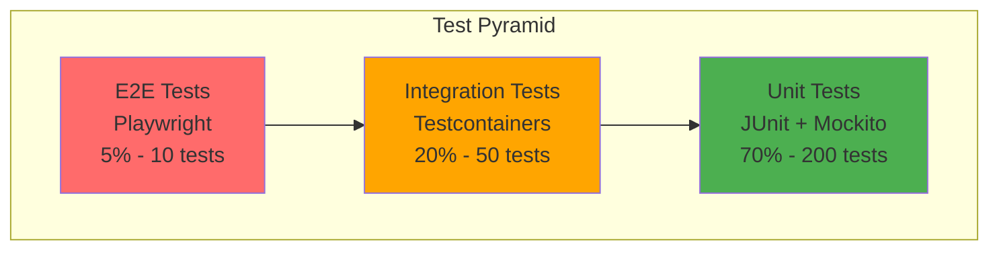

### Coverage Targets

- **Backend**: 70%+ overall, 90%+ for service layer
- **Frontend**: 60%+ overall, 80%+ for business logic
- **Critical Paths**: 100% (authentication, payment, standings calculation)

---

## 🚨 Risk & Mitigation

### Technical Risks

| Risk | Probability | Impact | Mitigation |
|------|-------------|--------|------------|
| **Schema explosion** | Medium | High | Monitor schema count, archive inactive tenants |
| **Connection pool exhaustion** | Medium | High | HikariCP tuning, connection monitoring |
| **Data loss** | Low | Critical | Daily backups, Multi-AZ RDS, test restores |
| **Performance degradation** | Medium | Medium | Redis caching, query optimization, indexing |
| **Security breach** | Low | Critical | Penetration testing, OWASP compliance, encryption |

---

## 📚 Architecture Decision Records (ADRs)

### ADR-001: Schema-per-Tenant Multi-Tenancy

**Status**: Accepted  
**Date**: 2025-01-15  
**Context**: Need to isolate tenant data securely while remaining cost-effective  
**Decision**: Use PostgreSQL schema-per-tenant  
**Consequences**: 
- ✅ Strong isolation
- ✅ Cost-effective for 1,000+ tenants
- ⚠️ Complex backup/restore per tenant
- ⚠️ Schema limit: ~50,000 (PostgreSQL)

### ADR-002: Modular Monolith over Microservices

**Status**: Accepted  
**Date**: 2025-01-15  
**Context**: Building MVP with limited resources, need fast iteration  
**Decision**: Start with modular monolith, extract microservices later  
**Consequences**:
- ✅ Faster development
- ✅ Simpler deployment
- ✅ Easier debugging
- ⚠️ Harder to scale specific components
- ⚠️ Requires discipline to maintain modularity

### ADR-003: Next.js 15 for Frontend

**Status**: Accepted  
**Date**: 2025-01-15  
**Context**: Need SSR for SEO, fast development, modern tooling  
**Decision**: Use Next.js 15 (latest stable) with App Router  
**Consequences**:
- ✅ Excellent developer experience (Turbopack)
- ✅ Server-side rendering for public pages
- ✅ React 19 features
- ⚠️ Learning curve for App Router
- ⚠️ Need to ensure library compatibility with React 19

### ADR-004: JWT Stateless Authentication

**Status**: Accepted  
**Date**: 2025-01-15  
**Context**: Need scalable authentication for distributed API servers  
**Decision**: Use JWT tokens (stateless) instead of server sessions  
**Consequences**:
- ✅ Scales horizontally (no shared session state)
- ✅ Works with load balancers
- ✅ Mobile-friendly
- ⚠️ Cannot revoke tokens before expiry (workaround: short expiry + refresh tokens)
- ⚠️ Larger payload than session ID

---

## 📖 References & Further Reading

### Internal Documentation
- [PROJECT_SETUP.md](./PROJECT_SETUP.md) - Setup instructions
- [IMPLEMENTATION_ROADMAP.md](./IMPLEMENTATION_ROADMAP.md) - Sprint guide
- [API_REFERENCE.md](./API_REFERENCE.md) - API documentation
- [DATABASE_SCHEMA.md](./DATABASE_SCHEMA.md) - Database design

### External Resources
- [Spring Boot Multi-Tenancy](https://www.baeldung.com/hibernate-5-multitenancy)
- [Next.js 15 Documentation](https://nextjs.org/docs)
- [PostgreSQL Schema Documentation](https://www.postgresql.org/docs/15/ddl-schemas.html)
- [AWS Well-Architected Framework](https://aws.amazon.com/architecture/well-architected/)

---

## 📝 Changelog

| Version | Date | Changes |
|---------|------|---------|
| 1.0 | 2025-01-15 | Initial architecture specification |

---

## ✅ Review Checklist

Before making architectural changes, review:

- [ ] Does this change align with quality attributes (security, scalability)?
- [ ] Have we documented the decision (ADR)?
- [ ] Does this affect tenant isolation?
- [ ] Is this change backwards compatible?
- [ ] Have we updated diagrams?
- [ ] Have we considered the scaling implications?
- [ ] Does this require infrastructure changes?

---

*Architecture Specification - Version 1.0*  
*Last Updated: January 2025*  
*Status: Living Document - Update as system evolves*
