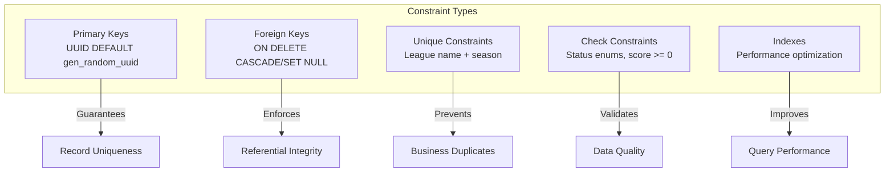
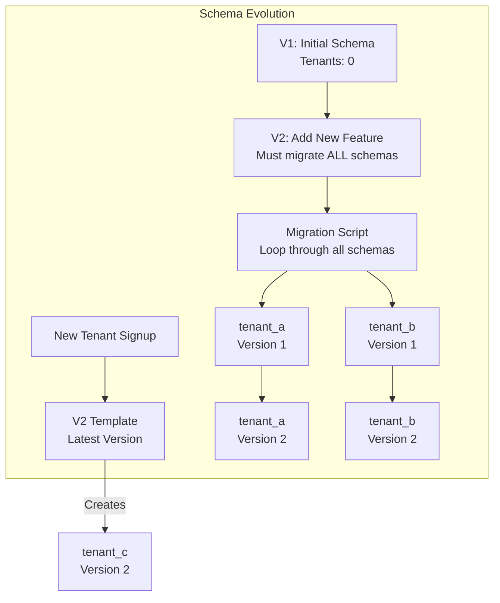

# Architecture Review Report

**Date**: October 24, 2025
**Reviewer**: Software Architecture Analysis
**Scope**: ARCHITECTURE.md vs Actual Implementation
**Status**: Gap Analysis & Recommendations

---

## Executive Summary

The ARCHITECTURE.md document provides an excellent high-level system design with comprehensive diagrams and explanations. However, several **critical discrepancies** exist between the documented architecture and the actual database schema implementation. This review identifies gaps, inconsistencies, and missing specifications that should be addressed.

**Overall Assessment**: ⚠️ **Moderate Issues Found**

- ✅ **Strengths**: Excellent high-level diagrams, clear multi-tenancy rationale, good ADR documentation
- ⚠️ **Gaps**: Missing constraints, incomplete indexes, undocumented fields, missing functions
- ❌ **Critical**: Payment transactions table not implemented, several documented features missing from schema

---

## Critical Findings

### 🔴 CRITICAL: Missing Tables

#### 1. `payment_transactions` Table
- **ARCHITECTURE.md Status**: Documented in ERD (lines 397-416) and referenced throughout
- **Actual Implementation**: ❌ **NOT IMPLEMENTED** in V1 migration
- **Impact**: HIGH - Cannot track payment history, essential for billing

**Location in ARCHITECTURE.md**: Line 401
```mermaid
SUBSCRIPTION ||--o{ PAYMENT_TRANSACTION : records
```

**Expected Schema** (from DATABASE_SCHEMA.md):
```sql
CREATE TABLE public.payment_transactions (
    id UUID PRIMARY KEY DEFAULT gen_random_uuid(),
    tenant_id UUID NOT NULL REFERENCES public.tenants(id),
    subscription_id UUID REFERENCES public.subscriptions(id),
    amount_cents INTEGER NOT NULL,
    currency VARCHAR(3) DEFAULT 'MXN',
    payment_method VARCHAR(50) NOT NULL,
    external_transaction_id VARCHAR(100),
    status VARCHAR(30) NOT NULL,
    failure_reason TEXT,
    created_at TIMESTAMP DEFAULT NOW()
);
```

**Recommendation**: Create `V3__add_payment_transactions.sql` migration immediately.

---

### 🟡 MAJOR: Missing Constraints & Validations

#### 1. Tenant Key Format Validation
- **ARCHITECTURE.md**: Not explicitly mentioned
- **DATABASE_SCHEMA.md**: Documented (line 72-73)
- **Actual Implementation**: ❌ **MISSING**

**Expected**:
```sql
CONSTRAINT check_tenant_key_format
    CHECK (tenant_key ~ '^[a-z0-9]+(-[a-z0-9]+)*$')
```

**Current**: No validation - allows invalid tenant keys that could break subdomain routing.

#### 2. Subscription Plan/Status Constraints
- **DATABASE_SCHEMA.md**: Documented (lines 74-77)
- **Actual Implementation**: ❌ **MISSING**

**Expected**:
```sql
CONSTRAINT check_subscription_plan
    CHECK (subscription_plan IN ('basic', 'pro', 'enterprise')),
CONSTRAINT check_subscription_status
    CHECK (subscription_status IN ('active', 'suspended', 'cancelled', 'trial'))
```

#### 3. Match Score Validation
- **DATABASE_SCHEMA.md**: Documented (lines 379-383)
- **Actual Implementation**: ❌ **MISSING**

**Expected**:
```sql
CONSTRAINT check_scores_non_negative
    CHECK (
        (home_score IS NULL OR home_score >= 0) AND
        (away_score IS NULL OR away_score >= 0)
    )
```

#### 4. League Date Validation
- **DATABASE_SCHEMA.md**: Documented (lines 259-260)
- **Actual Implementation**: ❌ **MISSING**

**Expected**:
```sql
CONSTRAINT check_dates
    CHECK (end_date IS NULL OR end_date >= start_date)
```

#### 5. Player Position Validation
- **DATABASE_SCHEMA.md**: Documented (lines 327-328)
- **Actual Implementation**: ❌ **MISSING**

**Expected**:
```sql
CONSTRAINT check_position
    CHECK (position IN ('goalkeeper', 'defender', 'midfielder', 'forward') OR position IS NULL)
```

#### 6. Match Event Minute Validation
- **DATABASE_SCHEMA.md**: Documented (lines 418-419)
- **Actual Implementation**: ❌ **MISSING**

**Expected**:
```sql
CONSTRAINT check_minute_valid
    CHECK (minute >= 0 AND minute <= 120)  -- Extra time
```

#### 7. Match Event Type Validation
- **DATABASE_SCHEMA.md**: Documented (lines 420-421)
- **Actual Implementation**: ❌ **MISSING**

**Expected**:
```sql
CONSTRAINT check_event_type
    CHECK (event_type IN ('goal', 'yellow_card', 'red_card', 'substitution', 'own_goal'))
```

#### 8. Match Status Validation
- **DATABASE_SCHEMA.md**: Documented (lines 384-385)
- **Actual Implementation**: ❌ **MISSING**

**Expected**:
```sql
CONSTRAINT check_match_status
    CHECK (status IN ('scheduled', 'in_progress', 'finished', 'cancelled', 'postponed'))
```

#### 9. Standings Integrity Constraints
- **DATABASE_SCHEMA.md**: Documented (lines 460-463)
- **Actual Implementation**: ❌ **MISSING**

**Expected**:
```sql
CONSTRAINT check_played_matches
    CHECK (played = won + drawn + lost),
CONSTRAINT check_points_calculation
    CHECK (points = (won * 3) + drawn)
```

---

### 🟡 MAJOR: Missing Indexes

#### 1. Subscription Status Index
- **DATABASE_SCHEMA.md**: Documented (line 83)
- **Actual Implementation**: ❌ **MISSING**

**Expected**:
```sql
CREATE INDEX idx_tenants_subscription_status ON public.tenants(subscription_status);
```

**Use Case**: Querying active/trial/suspended tenants for billing jobs.

#### 2. Subscription Indexes
- **DATABASE_SCHEMA.md**: Documented (lines 148-150)
- **Actual Implementation**: ✅ Partial (only tenant_id indexed)

**Missing**:
```sql
CREATE INDEX idx_subscriptions_status ON public.subscriptions(status);
CREATE INDEX idx_subscriptions_next_billing_date ON public.subscriptions(next_billing_date);
```

#### 3. Match Composite Indexes
- **DATABASE_SCHEMA.md**: Documented (lines 394-397)
- **Actual Implementation**: ❌ **MISSING**

**Expected**:
```sql
CREATE INDEX idx_matches_home_team_id ON __TENANT_SCHEMA__.matches(home_team_id);
CREATE INDEX idx_matches_away_team_id ON __TENANT_SCHEMA__.matches(away_team_id);
CREATE INDEX idx_matches_status ON __TENANT_SCHEMA__.matches(status);

-- Composite index for team's schedule
CREATE INDEX idx_matches_team_schedule
    ON __TENANT_SCHEMA__.matches(home_team_id, scheduled_at)
    WHERE status != 'cancelled';
```

**Use Case**: Efficiently querying team schedules.

#### 4. Match Events Indexes
- **DATABASE_SCHEMA.md**: Documented (lines 424-430)
- **Actual Implementation**: ✅ Partial

**Missing**:
```sql
CREATE INDEX idx_match_events_player_id ON __TENANT_SCHEMA__.match_events(player_id);
CREATE INDEX idx_match_events_type ON __TENANT_SCHEMA__.match_events(event_type);
CREATE INDEX idx_match_events_timeline
    ON __TENANT_SCHEMA__.match_events(match_id, minute);
```

#### 5. Standings Composite Index
- **DATABASE_SCHEMA.md**: Documented (lines 472-474)
- **Actual Implementation**: ❌ **MISSING**

**Expected**:
```sql
CREATE INDEX idx_standings_sort
    ON __TENANT_SCHEMA__.standings(league_id, points DESC, goals_for DESC, goals_against ASC);
```

**Use Case**: Optimizes standings table queries (very frequent).

#### 6. Player Name & Status Indexes
- **DATABASE_SCHEMA.md**: Documented (lines 331-333)
- **Actual Implementation**: ❌ **MISSING**

**Expected**:
```sql
CREATE INDEX idx_players_name ON __TENANT_SCHEMA__.players(full_name);
CREATE INDEX idx_players_is_active ON __TENANT_SCHEMA__.players(is_active);
```

#### 7. Team Name Index
- **DATABASE_SCHEMA.md**: Documented (line 296)
- **Actual Implementation**: ❌ **MISSING**

**Expected**:
```sql
CREATE INDEX idx_teams_name ON __TENANT_SCHEMA__.teams(name);
```

#### 8. League Status & Season Indexes
- **DATABASE_SCHEMA.md**: Documented (lines 263-264)
- **Actual Implementation**: ❌ **MISSING**

**Expected**:
```sql
CREATE INDEX idx_leagues_status ON __TENANT_SCHEMA__.leagues(status);
CREATE INDEX idx_leagues_season ON __TENANT_SCHEMA__.leagues(season);
```

---

### 🟡 MAJOR: Missing Unique Constraints

#### 1. League Name per Season
- **DATABASE_SCHEMA.md**: Documented (lines 266-269)
- **Actual Implementation**: ❌ **MISSING**

**Expected**:
```sql
CREATE UNIQUE INDEX idx_unique_league_name_season
    ON __TENANT_SCHEMA__.leagues(name, season)
    WHERE status != 'cancelled';
```

**Impact**: Prevents duplicate league names in same season.

#### 2. Team Name per League
- **DATABASE_SCHEMA.md**: Documented (lines 298-300)
- **Actual Implementation**: ❌ **MISSING**

**Expected**:
```sql
CREATE UNIQUE INDEX idx_unique_team_name_per_league
    ON __TENANT_SCHEMA__.teams(league_id, name);
```

**Impact**: Prevents duplicate team names in same league.

#### 3. Jersey Number per Team
- **DATABASE_SCHEMA.md**: Documented (lines 335-338)
- **Actual Implementation**: ❌ **MISSING**

**Expected**:
```sql
CREATE UNIQUE INDEX idx_unique_jersey_per_team
    ON __TENANT_SCHEMA__.players(team_id, jersey_number)
    WHERE is_active = TRUE AND jersey_number IS NOT NULL;
```

**Impact**: Prevents duplicate jersey numbers in active roster.

---

### 🟡 MAJOR: Missing Columns

#### 1. Subscription Status Column
- **ARCHITECTURE.md**: References subscription status tracking
- **DATABASE_SCHEMA.md**: Shows `status` column (line 136)
- **Actual Implementation**: ❌ **MISSING** from subscriptions table

**Expected**:
```sql
ALTER TABLE public.subscriptions ADD COLUMN status VARCHAR(30) NOT NULL DEFAULT 'active';
```

#### 2. Teams Captain Email
- **DATABASE_SCHEMA.md**: Documented (line 288)
- **Actual Implementation**: ❌ **MISSING**

**Expected**:
```sql
ALTER TABLE __TENANT_SCHEMA__.teams ADD COLUMN captain_email VARCHAR(150);
```

#### 3. Platform Users Last Login
- **DATABASE_SCHEMA.md**: Documented (line 174)
- **Actual Implementation**: ❌ **MISSING**

**Expected**:
```sql
ALTER TABLE public.platform_users ADD COLUMN last_login_at TIMESTAMP;
```

#### 4. Standings Goal Difference (Computed)
- **DATABASE_SCHEMA.md**: Documented (lines 476-478)
- **Actual Implementation**: ❌ **MISSING**

**Expected**:
```sql
ALTER TABLE __TENANT_SCHEMA__.standings
ADD COLUMN goal_difference INTEGER
GENERATED ALWAYS AS (goals_for - goals_against) STORED;
```

**Impact**: Critical for standings sorting performance.

---

### 🟢 MINOR: Missing Database Functions

#### 1. `update_updated_at_column()` Trigger Function
- **DATABASE_SCHEMA.md**: Documented (lines 86-97)
- **Actual Implementation**: ❌ **MISSING**

**Expected**:
```sql
CREATE OR REPLACE FUNCTION update_updated_at_column()
RETURNS TRIGGER AS $$
BEGIN
    NEW.updated_at = NOW();
    RETURN NEW;
END;
$$ LANGUAGE plpgsql;

CREATE TRIGGER update_tenants_updated_at
BEFORE UPDATE ON public.tenants
FOR EACH ROW
EXECUTE FUNCTION update_updated_at_column();
```

**Apply to**: tenants, subscriptions, leagues, teams, players, matches, standings

#### 2. `create_tenant_schema()` Provisioning Function
- **DATABASE_SCHEMA.md**: Documented (lines 487-526)
- **Actual Implementation**: ❌ **MISSING**

**Expected**: PL/pgSQL function to create tenant schema from template.

#### 3. `update_standings_after_match()` Function
- **DATABASE_SCHEMA.md**: Documented (lines 531-608)
- **ARCHITECTURE.md**: References automatic standings updates
- **Actual Implementation**: ❌ **MISSING**

**Critical**: This is core business logic mentioned in ARCHITECTURE.md (line 228).

#### 4. `calculate_age()` Function
- **DATABASE_SCHEMA.md**: Documented (lines 340-346)
- **Actual Implementation**: ❌ **MISSING**

**Expected**:
```sql
CREATE OR REPLACE FUNCTION __TENANT_SCHEMA__.calculate_age(birth_date DATE)
RETURNS INTEGER AS $$
BEGIN
    RETURN EXTRACT(YEAR FROM AGE(CURRENT_DATE, birth_date))::INTEGER;
END;
$$ LANGUAGE plpgsql IMMUTABLE;
```

---

## Inconsistencies Between Documents

### 1. ARCHITECTURE.md vs DATABASE_SCHEMA.md

| Aspect | ARCHITECTURE.md | DATABASE_SCHEMA.md | Recommendation |
|--------|-----------------|--------------------|-----------------|
| **ERD Completeness** | Shows relationships | Shows full DDL | ✅ Aligned |
| **payment_transactions** | Referenced in ERD | Full spec provided | ❌ Implement in schema |
| **Constraints** | Not detailed | Fully documented | ❌ Add to migrations |
| **Indexes** | Not detailed | Performance indexes | ❌ Add to migrations |
| **Functions** | High-level mention | Full implementation | ❌ Create migration |

### 2. Spring Boot Version Discrepancy

- **ARCHITECTURE.md**: States "Spring Boot 3.2" (lines 76, 82, 91, 107)
- **Actual pom.xml**: Uses Spring Boot 3.5.6
- **CLAUDE.md**: Correctly states 3.5.6

**Recommendation**: Update ARCHITECTURE.md to reflect actual version 3.5.6.

### 3. PostgreSQL Driver Version

- **ARCHITECTURE.md**: Shows "PostgreSQL 15+" throughout
- **Actual Implementation**: Correct
- **Status**: ✅ Aligned

---

## Documentation Improvements Needed

### 1. ARCHITECTURE.md Enhancements

#### Add Missing Sections

**Schema Migration Strategy** (Missing)
```markdown
### Schema Migration Strategy

**For Shared Schema**:
1. Create V{n}__description.sql in db/migration/
2. Apply to `public` schema
3. Test on development database
4. Deploy via Flyway auto-migration

**For Tenant Schemas**:
1. Update V2__create_tenant_schema_template.sql
2. Create migration script to apply to existing tenants:
   ```sql
   DO $$
   DECLARE
       tenant_schema TEXT;
   BEGIN
       FOR tenant_schema IN
           SELECT schema_name FROM information_schema.schemata
           WHERE schema_name LIKE 'tenant_%'
       LOOP
           EXECUTE format('ALTER TABLE %I.leagues ADD COLUMN new_column VARCHAR(100)', tenant_schema);
       END LOOP;
   END $$;
   ```
```

**Connection Pooling Configuration** (Referenced but not detailed)
```markdown
### Connection Pool Configuration (HikariCP)

```yaml
spring:
  datasource:
    hikari:
      maximum-pool-size: 20       # Per instance
      minimum-idle: 5
      connection-timeout: 30000   # 30 seconds
      idle-timeout: 600000        # 10 minutes
      max-lifetime: 1800000       # 30 minutes
```

**Why these values?**:
- Maximum 20 connections per EC2 instance
- With 2 instances: 40 connections max
- PostgreSQL max_connections: 100 (allows headroom)
- Schema count: 1,000+ tenants sharing same pool
```

**Redis Cache Implementation Details** (Mentioned but not specified)
```markdown
### Redis Caching Implementation

**Spring Configuration**:
```java
@Configuration
@EnableCaching
public class CacheConfig {

    @Bean
    public RedisCacheManager cacheManager(RedisConnectionFactory factory) {
        RedisCacheConfiguration config = RedisCacheConfiguration.defaultCacheConfig()
            .entryTtl(Duration.ofMinutes(5))
            .serializeValuesWith(/* Jackson JSON */);

        return RedisCacheManager.builder(factory)
            .cacheDefaults(config)
            .withCacheConfiguration("standings",
                config.entryTtl(Duration.ofMinutes(5)))
            .build();
    }
}
```

**Cache Keys**:
- `standings:{leagueId}` - TTL: 5 min
- `matches:upcoming:{leagueId}` - TTL: 1 hour
- `teams:{leagueId}` - TTL: 30 min
```

#### Clarify Multi-Tenancy Implementation Details

Currently ARCHITECTURE.md shows the flow diagram (excellent) but doesn't specify:
- **ThreadLocal cleanup strategy** - When/how is it cleared?
- **Request interceptor order** - Where does TenantInterceptor fit in filter chain?
- **Schema search_path setting** - Does Hibernate use SET search_path or schema-qualified queries?

**Recommendation**: Add "Multi-Tenancy Implementation Details" section.

### 2. DATABASE_SCHEMA.md Enhancements

#### Add Schema Versioning Table

Current gap: No tracking of which version each tenant schema is at.

**Recommendation**:
```sql
-- Add to shared schema
CREATE TABLE public.tenant_schema_versions (
    tenant_id UUID NOT NULL REFERENCES public.tenants(id),
    schema_version INTEGER NOT NULL,
    applied_at TIMESTAMP DEFAULT NOW(),
    migration_script VARCHAR(255),
    PRIMARY KEY (tenant_id, schema_version)
);
```

#### Document Tenant Schema Provisioning Process

Currently DATABASE_SCHEMA.md shows the function but not the process.

**Add Section**:
```markdown
### Tenant Provisioning Workflow

1. **Signup Request Received**
2. **Generate Tenant Key**: Slugify business name → "canchas-del-norte"
3. **Validate Uniqueness**: Check `tenants.tenant_key` not exists
4. **Create Tenant Record**:
   ```sql
   INSERT INTO public.tenants (tenant_key, schema_name, ...)
   VALUES ('canchas-del-norte', 'tenant_canchas_del_norte', ...);
   ```
5. **Create Schema**: Execute template with search/replace
6. **Create Initial Data**: Insert default settings
7. **Record Schema Version**: Insert into `tenant_schema_versions`
8. **Create Subscription**: Insert into `subscriptions`, call payment gateway
9. **Return JWT Token**: Include tenant_key in claims
```

### 3. API_REFERENCE.md Alignment

The API documentation references endpoints and features not yet implemented:

**Endpoints Documented but No Backend Exists**:
- `/auth/signup` - No AuthController yet
- `/auth/login` - No AuthService yet
- `/leagues` - No LeagueController yet
- `/matches/{id}/result` - No MatchService yet
- `/matches/{id}/events` - No MatchEventService yet

**Recommendation**: Add implementation status indicators:
```markdown
### Implementation Status Legend
- ✅ Implemented
- 🚧 In Progress
- ⏳ Planned

#### POST `/auth/signup` ⏳ Planned
Create new tenant account (field owner registration).
```

---

## Recommended Migration Plan

### Phase 1: Critical Fixes (Week 1)

**Migration: V3__add_critical_constraints_and_indexes.sql**
```sql
-- Add payment_transactions table
CREATE TABLE public.payment_transactions (...);

-- Add missing constraints to tenants
ALTER TABLE public.tenants
ADD CONSTRAINT check_tenant_key_format
    CHECK (tenant_key ~ '^[a-z0-9]+(-[a-z0-9]+)*$');

-- Add subscription status column
ALTER TABLE public.subscriptions
ADD COLUMN status VARCHAR(30) NOT NULL DEFAULT 'active';

-- Add critical indexes
CREATE INDEX idx_tenants_subscription_status ON public.tenants(subscription_status);
CREATE INDEX idx_subscriptions_status ON public.subscriptions(status);
```

**Migration: V4__add_tenant_schema_constraints.sql**
```sql
-- This migration must loop through ALL existing tenant schemas
-- Template for applying to each tenant schema:

DO $$
DECLARE
    tenant_schema TEXT;
BEGIN
    FOR tenant_schema IN
        SELECT schema_name FROM information_schema.schemata
        WHERE schema_name LIKE 'tenant_%'
    LOOP
        -- Add match constraints
        EXECUTE format('
            ALTER TABLE %I.matches
            ADD CONSTRAINT check_scores_non_negative
            CHECK (
                (home_score IS NULL OR home_score >= 0) AND
                (away_score IS NULL OR away_score >= 0)
            )', tenant_schema);

        -- Add standings constraints
        EXECUTE format('
            ALTER TABLE %I.standings
            ADD CONSTRAINT check_played_matches
            CHECK (played = won + drawn + lost)', tenant_schema);

        -- Add goal_difference computed column
        EXECUTE format('
            ALTER TABLE %I.standings
            ADD COLUMN goal_difference INTEGER
            GENERATED ALWAYS AS (goals_for - goals_against) STORED', tenant_schema);
    END LOOP;
END $$;
```

### Phase 2: Performance Optimization (Week 2)

**Migration: V5__add_performance_indexes.sql**
```sql
-- Shared schema indexes
CREATE INDEX idx_subscriptions_next_billing_date
    ON public.subscriptions(next_billing_date);

-- Tenant schema indexes (loop through all)
DO $$
DECLARE
    tenant_schema TEXT;
BEGIN
    FOR tenant_schema IN
        SELECT schema_name FROM information_schema.schemata
        WHERE schema_name LIKE 'tenant_%'
    LOOP
        -- Match composite indexes
        EXECUTE format('
            CREATE INDEX idx_matches_team_schedule
            ON %I.matches(home_team_id, scheduled_at)
            WHERE status != ''cancelled''', tenant_schema);

        -- Standings sort optimization
        EXECUTE format('
            CREATE INDEX idx_standings_sort
            ON %I.standings(league_id, points DESC, goals_for DESC, goals_against ASC)',
            tenant_schema);
    END LOOP;
END $$;
```

### Phase 3: Business Logic Functions (Week 3)

**Migration: V6__add_database_functions.sql**
```sql
-- Shared schema functions
CREATE OR REPLACE FUNCTION update_updated_at_column()
RETURNS TRIGGER AS $$ ... $$;

CREATE OR REPLACE FUNCTION public.create_tenant_schema(tenant_key VARCHAR)
RETURNS VOID AS $$ ... $$;

-- Apply triggers to all tables
CREATE TRIGGER update_tenants_updated_at
BEFORE UPDATE ON public.tenants
FOR EACH ROW EXECUTE FUNCTION update_updated_at_column();

-- Tenant schema functions (add to template)
-- Update V2__create_tenant_schema_template.sql to include:
CREATE OR REPLACE FUNCTION __TENANT_SCHEMA__.calculate_age(birth_date DATE)
RETURNS INTEGER AS $$ ... $$;

CREATE OR REPLACE FUNCTION __TENANT_SCHEMA__.update_standings_after_match(match_id_param UUID)
RETURNS VOID AS $$ ... $$;
```

### Phase 4: Update Template (Week 3)

**Update: V2__create_tenant_schema_template.sql**

Add all missing constraints, indexes, unique constraints, and functions to the template so new tenants get the complete schema.

---

## Testing Recommendations

### 1. Schema Validation Tests

Create integration tests to verify schema matches specification:

```java
@Test
public void shouldHaveAllRequiredConstraints() {
    // Query pg_constraint to verify all CHECK constraints exist
    String sql = """
        SELECT conname FROM pg_constraint
        WHERE conrelid = 'public.tenants'::regclass
        AND contype = 'c'
        """;
    List<String> constraints = jdbcTemplate.queryForList(sql, String.class);

    assertThat(constraints)
        .contains("check_tenant_key_format")
        .contains("check_subscription_plan")
        .contains("check_subscription_status");
}

@Test
public void shouldHaveAllRequiredIndexes() {
    // Similar test for indexes
}
```

### 2. Multi-Tenancy Isolation Tests

```java
@Test
public void shouldIsolateTenantData() {
    // Create test data in tenant A schema
    // Attempt to query from tenant B context
    // Should return empty, not tenant A data
}
```

### 3. Constraint Violation Tests

```java
@Test
public void shouldRejectInvalidTenantKey() {
    assertThatThrownBy(() ->
        tenantRepository.save(new Tenant("Invalid Key!", ...))
    ).isInstanceOf(DataIntegrityViolationException.class);
}
```

---

## ARCHITECTURE.md Diagram Improvements

### 1. Add Database Constraint Diagram

Currently missing: Visual representation of constraints

**Recommendation**: Add to ARCHITECTURE.md after ERD



### 2. Add Tenant Schema Evolution Diagram

Currently ARCHITECTURE.md shows provisioning but not evolution.

**Recommendation**: Add migration strategy diagram



---

## Summary of Required Actions

### Immediate (Before MVP Launch)

1. ✅ **Create V3 Migration**: Add payment_transactions table + critical constraints
2. ✅ **Create V4 Migration**: Add all missing constraints to tenant schemas
3. ✅ **Create V5 Migration**: Add performance indexes
4. ✅ **Create V6 Migration**: Add database functions (triggers, standings calculation)
5. ✅ **Update V2 Template**: Include all constraints/indexes for new tenants
6. ✅ **Update ARCHITECTURE.md**: Fix Spring Boot version, add implementation sections
7. ✅ **Update API_REFERENCE.md**: Add implementation status indicators

### Short-term (Sprint 1-2)

8. ✅ **Create Integration Tests**: Schema validation tests
9. ✅ **Document Migration Process**: How to update tenant schemas
10. ✅ **Add Monitoring**: Track schema count, index usage

### Medium-term (Sprint 3-4)

11. ✅ **Performance Testing**: Verify index effectiveness with realistic data
12. ✅ **Backup/Restore Testing**: Test per-tenant backup process
13. ✅ **Schema Version Tracking**: Implement tenant_schema_versions table

---

## Conclusion

The ARCHITECTURE.md provides an excellent foundation with clear diagrams and rationale for key decisions. However, the **database schema implementation is incomplete** compared to the documented specifications. This review has identified:

- **1 Critical Issue**: Missing payment_transactions table
- **9 Major Issues**: Missing constraints that affect data integrity
- **13 Major Issues**: Missing indexes that affect performance
- **3 Major Issues**: Missing unique constraints that prevent duplicates
- **4 Major Issues**: Missing columns referenced in documentation
- **4 Minor Issues**: Missing database functions documented in specs

**Overall Risk Level**: ⚠️ **MEDIUM**
- Data integrity risks from missing constraints
- Performance risks from missing indexes
- Documentation drift risks from incomplete implementation

**Recommendation**: Execute the 4-phase migration plan outlined above before public launch. All identified gaps are fixable with database migrations and do not require application code changes.

---

**Report prepared by**: Architecture Review Analysis
**Next Review**: After implementing V3-V6 migrations
**Questions/Feedback**: Update this document with findings
